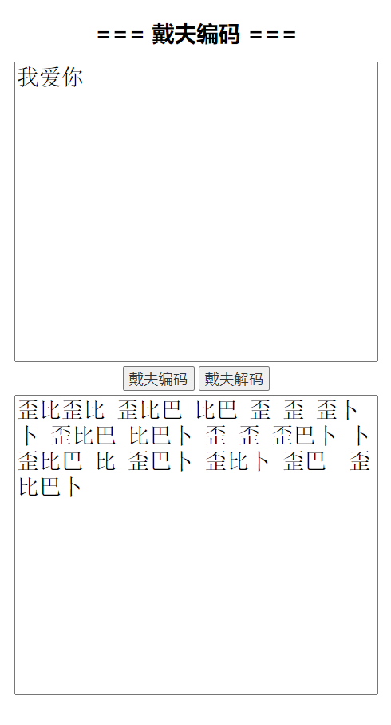
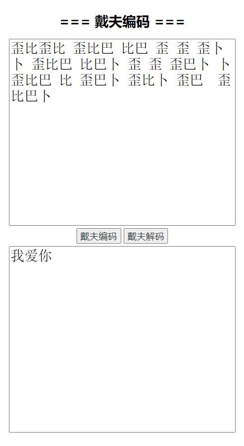

# daifu

#### 介绍
戴夫加密通讯

#### 软件架构
python3

or

javascript

#### Python使用说明

```python
daifu_encode("需要加密的明文")  # 返回密文
daifu_decode("需要解密的密文")  # 返回明文
```

#### javascript使用样例

[https://cloud.jeffz.cn/websites/daifu/](https://cloud.jeffz.cn/websites/daifu/)




